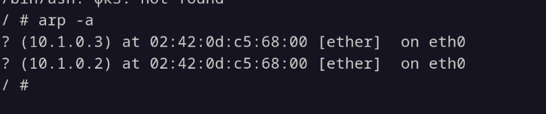
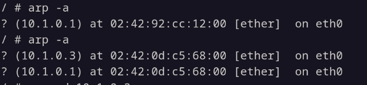

1) Сначала делаем ping со стороны sender-a. Запись об этом одна из первых: Who has 10.1.0.2? Tell 10.1.0.1 - пытаемся достучаться до receiver-a, видим его MAC-адрес. Потом идет несколько эхо-обменов. 

2) Затем мы запускаем атаку: опять видим запись Who has 10.1.0.2? Tell уже 10.1.0.3, Who has 10.1.0.1? Tell 10.1.0.3 - с помощью arp узнали где сидит receiver и sender из attacker-a. Здесь идёт подмена MAC-адреса sender-a для receiver-a, теперь трафик проходит через 02:42:0d:c5:68:00 - это MAC-адрес attacker-a. Attacker подделывает ARP-таблицу, подменяя ping-запросы от имени sender. Теперь под ip 10.1.0.1 сидит attacker, а не sender! Также мы обманываем и sender-a - теперь для него attacker стал receiver-ом:

3) До:
        Эхо-запрос: MAC отправителя = 02:42:92:cc:12:00 (sender)
        Эхо-ответ:  MAC отправителя = 02:42:5a:64:33:00 (receiver)
    После:
        Эхо-запрос: MAC отправителя = 02:42:92:cc:12:00 (sender)
        Эхо-ответ:  MAC отправителя = 02:42:0d:c5:68:00 (attacker)!
Итог, читаемый по сетевой трассе: атакующий полностью перехватывает и модифицирует сетевые пакеты, после атаки видно общение attacker-receiver.

